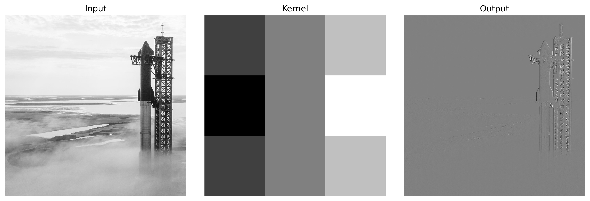
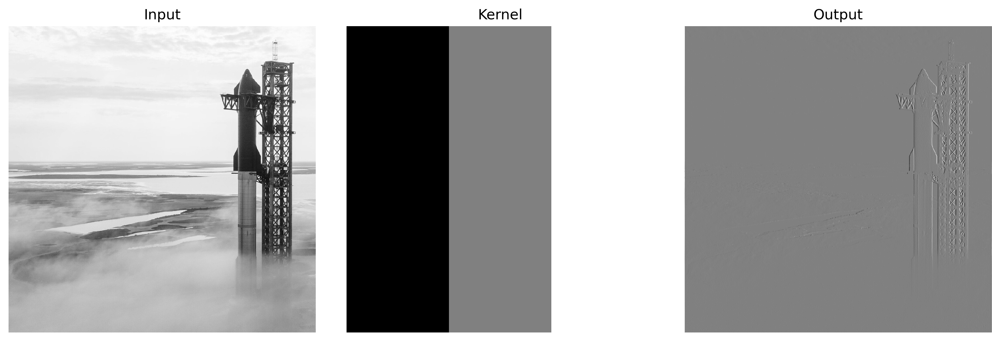
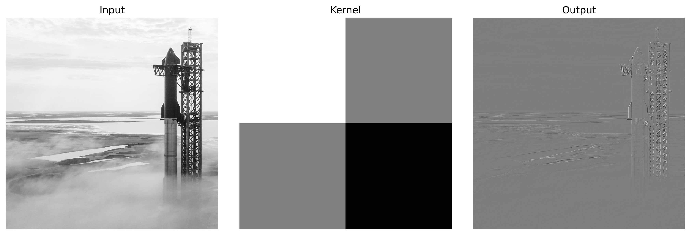
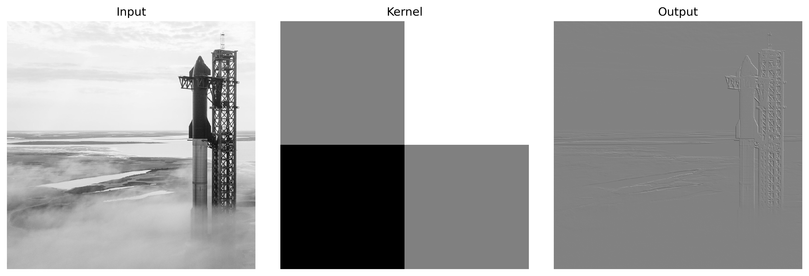
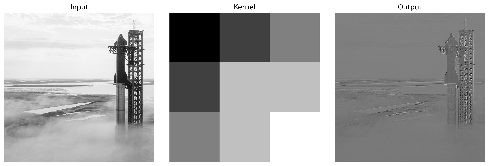
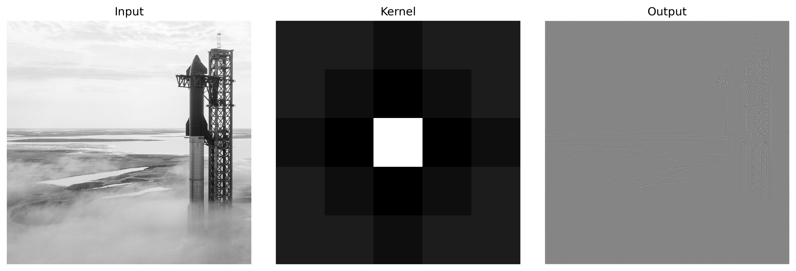
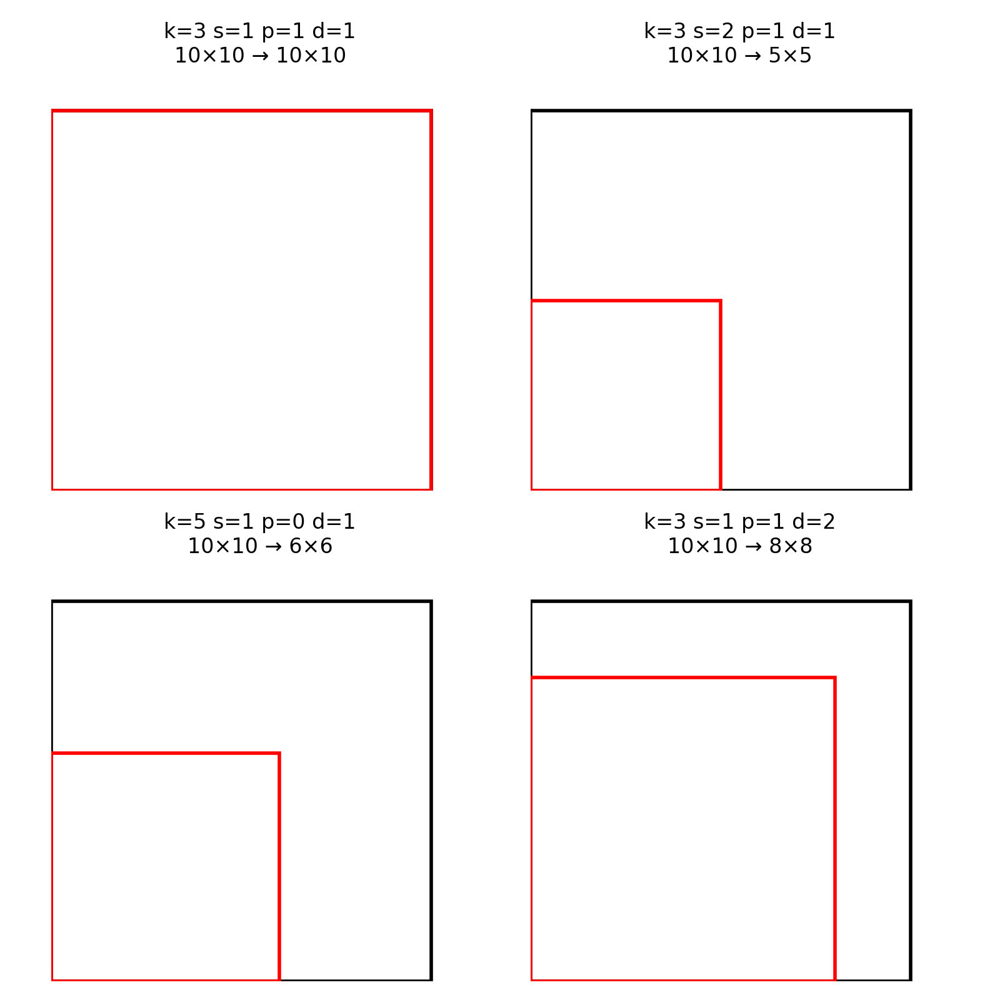

## ABSTRACT

2D convolution underlies convolutional neural network architectures in computer vision. This tutorial, aimed at beginners in deep learning and computer vision, provides a comprehensive presentation from the mathematical foundations of the operation through practical implementation and optimization in PyTorch. We systematically examine key parameters such as stride, padding and dilation and elucidate their effects through annotated code examples and visualizations before and after convolution. Upon completing this tutorial, readers will be able to design and configure their own Conv2D layers and justify hyperparameter choices for use cases ranging from edge detection to image classification.

 

## INTRODUCTION

This tutorial paper provides a comprehensive introduction to the Conv2D layer, a core component of Convolutional Neural Networks (CNNs), with a focus on its mathematical foundation, configuration parameters, and role in feature extraction for computer vision tasks.

 

## CONFIGURATION

| Parameter    | Description                                                           | Too high effect                                         | Too low effect                                                          |
| :----------- | :-------------------------------------------------------------------- | :------------------------------------------------------ | :---------------------------------------------------------------------- |
| in_channels  | Number of channels in the input image.                                | Risk of overfitting and unnecessary complexity.         | Insufficient feature extraction.                                        |
| out_channels | Number of output feature maps produced by the convolutional layer.      | Increased computational cost and overparameterization.  | Reduced feature extraction capacity.                                    |
| kernel_size  | Dimensions of the convolutional filter applied to the input.          | Loss of local details and excessive processing.         | Risk of undercapturing local patterns.                                  |
| stride       | Step size that determines how the filter moves across the input.        | Undersampled output with loss of spatial information.   | Redundant outputs and over-decomposition.                               |
| padding      | Number of pixels added around the input to control the output size.     | Introduction of artifacts and edge distortion.          | Loss of border information.                                             |
| dilation     | Spacing between elements within the kernel to expand the receptive field.| Dilutes local relationships, reducing precision.        | Reduced receptive field, limiting context capture.                      |
| bias         | Indicates whether a learnable bias is added to the output.              | May lead to overcorrection due to excessive adjustment.  | Lack of flexibility in adjusting the model.                             |

 

## CONVOLUTION OPERATION

In a Convolutional Neural Network, the convolution operation is the fundamental mechanism by which local features are extracted from input data. In this process, a kernel (or filter) of fixed dimensions is systematically applied to the input feature map by moving it across spatial positions. For each location (i,j) in the output feature map, the convolution operation computes a weighted sum of the values in the receptive field of the input. This is achieved by aligning the kernel with a corresponding patch of the input, performing an element-wise multiplication between the kernel weights and the input values, and summing the results.

The mathematical formulation of this operation is given by :

 

$$O(i,j)= \sum_{m=0}^{K_h-1}\sum_{n=0}^{K_w-1}I\bigl(i\,s + m - p,\; j\,s + n - p\bigr)\;K(m,n)$$

 

- $I$ denotes the input feature map  
- $K$ represents the convolution kernel of dimensions $K_h \times K_w$   
- $s$ is the stride, which dictates the step size for sliding the kernel over the input  
- $p$ corresponds to the amount of zero-padding added to the input border

The role of the stride and padding is essential in controlling both the resolution of the output feature map and the preservation of spatial information at the edges of the input. This equation encapsulates the local aggregation process, thereby enabling the network to build up complex representations by hierarchically combining simple features detected in the early layers.

 

### VISUAL EXAMPLES

To illustrate how convolutional filters uncover image structure, we apply three edge detectors to the same grayscale input. The Sobel X kernel approximates the horizontal intensity derivative, causing vertical features to stand out. The Sobel Y kernel approximates the vertical derivative, making horizontal transitions more visible. The Laplacian kernel computes the second derivative of intensity and highlights every edge irrespective of orientation. In each example you will see the input image on the left, the kernel visualization in the center, and the resulting feature map on the right.

 

$$
O(i,j)= \sum_{m=0}^{2}\sum_{n=0}^{2}I\bigl(i\,s + m - p,\; j\,s + n - p\bigr)\;K(m,n)
\quad\text{with}\quad
K = \begin{bmatrix}
-1 & 0 & 1\\
-2 & 0 & 2\\
-1 & 0 & 1
\end{bmatrix}
$$

 

  
Figure 1: **Sobel X** – vertical edges.

---

 

$$
O(i,j)= \sum_{m=0}^{2}\sum_{n=0}^{2}I\bigl(i\,s + m - p,\; j\,s + n - p\bigr)\;K(m,n)
\quad\text{with}\quad
K = \begin{bmatrix}
-1 & -2 & -1\\
0  &  0 &  0\\
1  &  2 &  1
\end{bmatrix}
$$

 

  
Figure 2: **Sobel Y** – horizontal edges.

---

 

$$
O(i,j)= \sum_{m=0}^{2}\sum_{n=0}^{2}I\bigl(i\,s + m - p,\; j\,s + n - p\bigr)\;K(m,n)
\quad\text{with}\quad
K = \begin{bmatrix}
0 & 1 & 0\\
1 & -4 & 1\\
0 & 1 & 0
\end{bmatrix}
$$

 

  
Figure 3: **Laplacian** – all edges.

---

 

$$
O(i,j)= \sum_{m=0}^{2}\sum_{n=0}^{2}I\bigl(i\,s + m - p,\; j\,s + n - p\bigr)\;K(m,n)
\quad\text{with}\quad
K = \begin{bmatrix}
-1 &  0 & 1\\
-1 &  0 & 1\\
-1 &  0 & 1
\end{bmatrix}
$$

 

  
Figure 4: **Prewitt X** – vertical edges.

---

 

$$
O(i,j)= \sum_{m=0}^{2}\sum_{n=0}^{2}I\bigl(i\,s + m - p,\; j\,s + n - p\bigr)\;K(m,n)
\quad\text{with}\quad
K = \begin{bmatrix}
-1 & -1 & -1\\
 0 &  0 &  0\\
 1 &  1 &  1
\end{bmatrix}
$$

 

  
Figure 5: **Prewitt Y** – horizontal edges.

---

 

$$
O(i,j)= \sum_{m=0}^{1}\sum_{n=0}^{1}I\bigl(i\,s + m - p,\; j\,s + n - p\bigr)\;K(m,n)
\quad\text{with}\quad
K = \begin{bmatrix}
1 &  0\\
0 & -1
\end{bmatrix}
$$

 

  
Figure 6: **Roberts X** – diagonal edges (↗︎ direction).

---

 

$$
O(i,j)= \sum_{m=0}^{1}\sum_{n=0}^{1}I\bigl(i\,s + m - p,\; j\,s + n - p\bigr)\;K(m,n)
\quad\text{with}\quad
K = \begin{bmatrix}
0 &  1\\
-1 & 0
\end{bmatrix}
$$

 

  
Figure 7: **Roberts Y** – diagonal edges (↘︎ direction).

---

 

$$
O(i,j)= \sum_{m=0}^{2}\sum_{n=0}^{2}I\bigl(i\,s + m - p,\; j\,s + n - p\bigr)\;K(m,n)
\quad\text{with}\quad
K = \begin{bmatrix}
-2 & -1 & 0\\
-1 &  1 & 1\\
 0 &  1 & 2
\end{bmatrix}
$$

 

  
Figure 8: **Emboss** – relief effect in a given direction.

---

 

$$
O(i,j)= \sum_{m=0}^{4}\sum_{n=0}^{4}I\bigl(i\,s + m - p,\; j\,s + n - p\bigr)\;K(m,n)
\quad\text{with}\quad
K = \begin{bmatrix}
0  & 0  & -1 & 0  & 0\\
0  & -1 & -2 & -1 & 0\\
-1 & -2 & 16 & -2 & -1\\
0  & -1 & -2 & -1 & 0\\
0  & 0  & -1 & 0  & 0
\end{bmatrix}
$$

 

  
Figure 9: **LoG (Laplacian of Gaussian)** – combined smoothing and edge enhancement.

 

## OUTPUT DIMENSION CALCULATION

In Convolutional Neural Networks, it is crucial to compute the dimensions of the output feature map resulting from the convolution operation. This computation ensures that the network architecture is correctly designed and that the spatial structure of the data is maintained or intentionally altered as needed. The output height and width are determined by four main parameters:

 

$$
H_{out} = \frac{H_{in} + 2p - d \cdot (K_h - 1) - 1}{s} + 1
$$  
$$
W_{out} = \frac{W_{in} + 2p - d \cdot (K_w - 1) - 1}{s} + 1
$$

 

- $H_{in}, W_{in}$ denote the height and width of the input feature map  
- $H_{out}, W_{out}$ denote the height and width of the output feature map  
- $K_h, K_w$ represent the height and width of the kernel, respectively  
- $s$ is the stride, which dictates the step size for sliding the kernel over the input  
- $p$ corresponds to the amount of zero-padding added to the input border  
- $d$ is the dilation, which specifies the spacing between elements of the kernel

 

  
Figure 8: <strong>Convolution Output Dimensions</strong> – Output size of a convolution operation as a function of kernel size (k), stride (s), padding (p), and dilation (d).

 
 

## MULTI-CHANNEL CONVOLUTION

In multi-channel convolution, each filter is applied to every input channel. The outputs are summed across channels to produce each output feature map. For an input with \(C_{in}\) channels, the operation is given by:

 

$$
O(i,j) = \sum_{c=1}^{C_{in}} \sum_{m=0}^{K_h-1}\sum_{n=0}^{K_w-1} I_c(i\,s + m - p,\; j\,s + n - p)\;K_c(m,n)
$$

 

## BIAS

After convolution, a learnable bias is added to each output channel. This allows the output to be shifted and is computed as:

 

$$
O(i,j) = \left( \sum_{c=1}^{C_{in}} \sum_{m=0}^{K_h-1}\sum_{n=0}^{K_w-1} I_c(i\,s + m - p,\; j\,s + n - p)\;K_c(m,n) \right) + b
$$

 

## BACKPROPAGATION

Backpropagation computes the gradients of the loss function with respect to each parameter using the chain rule. In convolutional layers, error gradients are propagated by convolving the gradient of the output with rotated filters.

 

## GRADIENT

The gradient with respect to the weights is given by:

 

$$
\frac{\partial L}{\partial K_c(m,n)} = \sum_{i,j} \frac{\partial L}{\partial O(i,j)} \cdot I_c(i\,s + m - p,\; j\,s + n - p)
$$

 

The gradient with respect to the bias is computed as:

 

$$
\frac{\partial L}{\partial b} = \sum_{i,j} \frac{\partial L}{\partial O(i,j)}
$$

 

## SOURCES

PyTorch documentation
> https://pytorch.org/docs/stable/generated/torch.nn.Conv2d.html

 

Tensorflow documentation
> https://www.tensorflow.org/api_docs/python/tf/keras/layers/Conv2D

 

CS231n Deep Learning for Computer Vision
> http://cs231n.github.io/convolutional-networks/

 

Dive into Deep Learning
> https://d2l.ai/chapter_convolutional-neural-networks/conv.html

 

Deep Learning an MIT Press book
> https://www.deeplearningbook.org/

 

## CONTRIBUTORS

Sasha MARMAIN

Killian OTT

