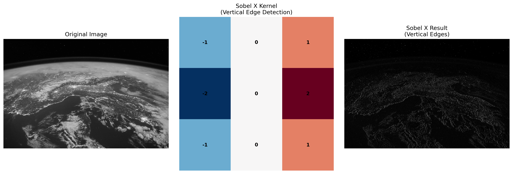
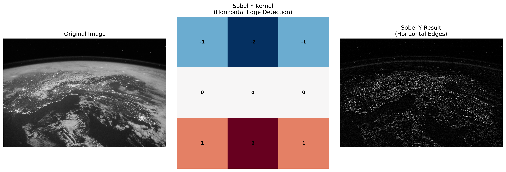
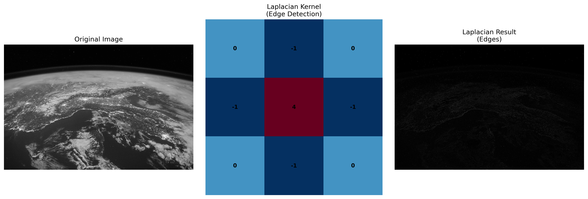
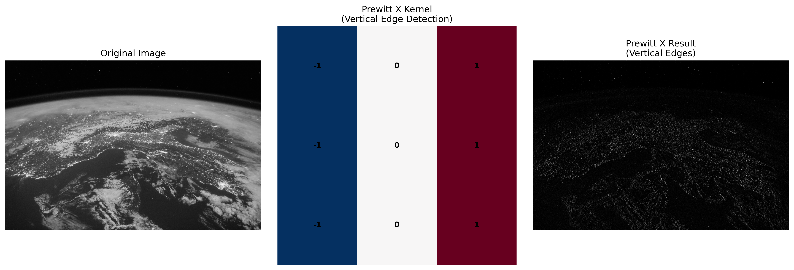
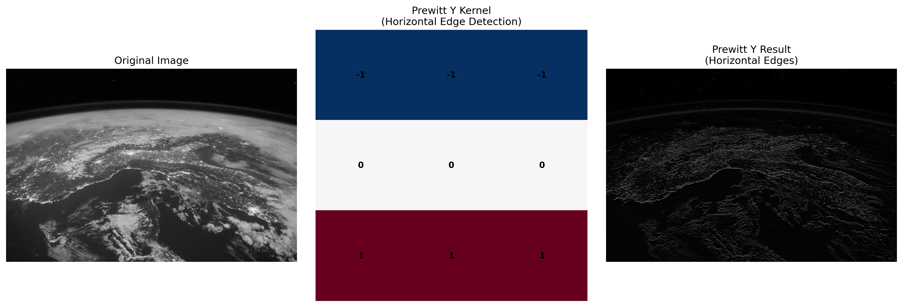
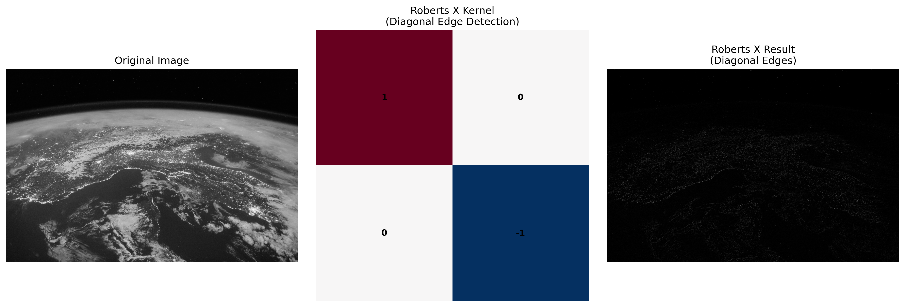
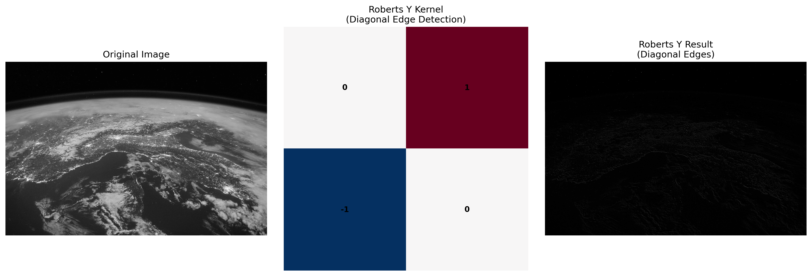
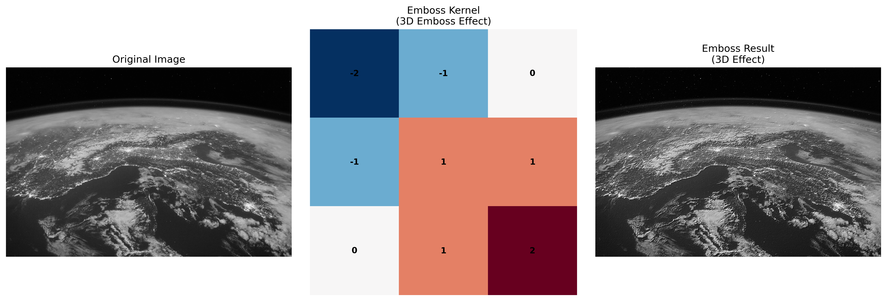
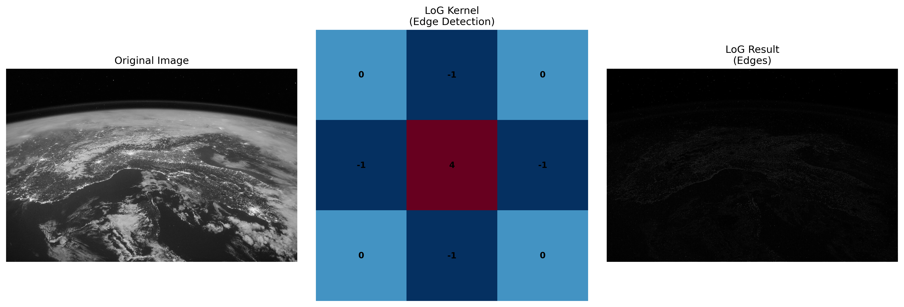
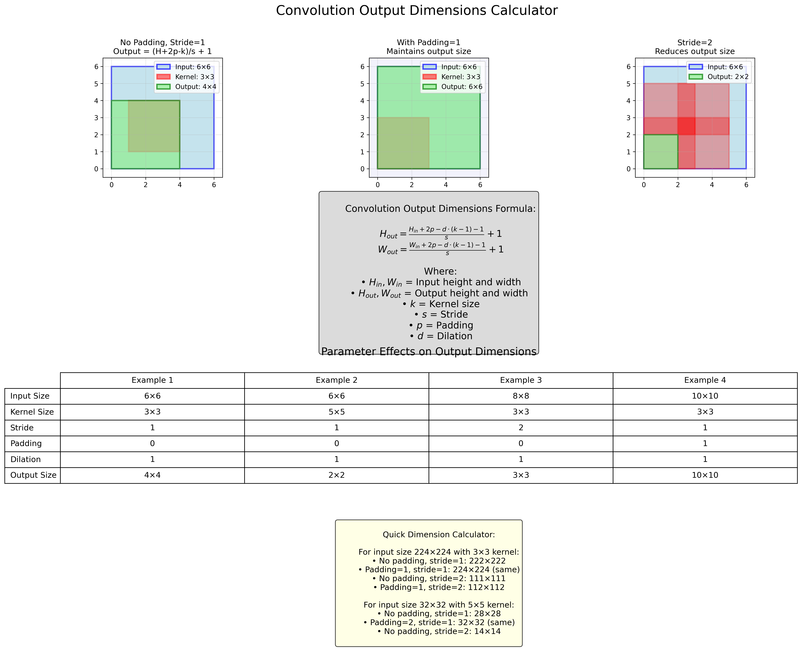

<a href="https://www.teamcardinalis.com/">
   
</a>

# 2D Convolution

## Abstract

This tutorial is a rigorous and practical guide to 2D convolution, the core building block of modern computer vision models. We start with intuition, then derive the complete arithmetic for output shapes, receptive fields, parameters, and FLOPs. We cover padding/stride/dilation semantics, grouped/depthwise/pointwise convolutions, and provide concise PyTorch examples and visual demonstrations. References include the canonical guide by Dumoulin and Visin.

## Table of Contents

1. [What is Convolution?](#what-is-convolution)
2. [Cross-correlation vs. Convolution](#cross-correlation-vs-convolution)
3. [Core Configuration](#core-configuration)
4. [Output Shapes, Parameters, FLOPs](#output-shapes-parameters-flops)
5. [Receptive Field](#receptive-field)
6. [PyTorch Essentials](#pytorch-essentials)
7. [Visual Examples](#visual-examples)
8. [Best Practices and Pitfalls](#best-practices-and-pitfalls)
9. [References](#references)
10. [Contributors](#contributors)

## What is Convolution?

Convolution extracts local patterns by sliding a small kernel over an input and computing a weighted sum at each location, producing feature maps that respond strongly where the pattern occurs. Stacking layers progressively builds from edges and textures to shapes and semantics.

Given a single-channel input \(I\) and kernel \(K\), the 2D operation at output location \((i,j)\) is the weighted sum over a local neighborhood. With stride and padding, the kernel samples input locations at a defined step and handles borders deterministically.

## Cross-correlation vs. Convolution

Most deep learning libraries implement cross-correlation (no kernel flip) under the name "convolution". For almost all CNN use-cases, this distinction is immaterial because the kernel is learned. Below, we present the cross-correlation form used by PyTorch and TensorFlow.

For a single input channel and kernel size \(K_h \times K_w\):

\[ O(i,j) = \sum_{m=0}^{K_h-1} \sum_{n=0}^{K_w-1} I(i \cdot s + m - p_h,\; j \cdot s + n - p_w) \cdot K(m,n) \]

For multi-channel input with \(C_{in}\) channels:

\[ O(i,j) = \sum_{c=0}^{C_{in}-1} \sum_{m=0}^{K_h-1} \sum_{n=0}^{K_w-1} I_c(i \cdot s + m - p_h,\; j \cdot s + n - p_w) \cdot K_{c}(m,n) \]

## Core Configuration

- **Kernel size (kH, kW)**: Spatial extent of the local neighborhood.
- **Stride (sH, sW)**: Step between kernel applications.
- **Padding (pH, pW)**: Zeros added around the input. Common presets: "valid" (no padding), "same" (preserve spatial size when stride=1).
- **Dilation (dH, dW)**: Spacing between kernel elements; expands the receptive field without more parameters.
- **Channels**: `in_channels` and `out_channels`. Learnable weight tensor shape is `(out_channels, in_channels/groups, kH, kW)`.
- **Groups**: Split input channels and weights into `groups` independent convolutions. Special cases: `groups=in_channels` (depthwise), followed by `1x1` pointwise for depthwise-separable.

## Output Shapes, Parameters, FLOPs

For input size \((H_{in}, W_{in})\), kernel \((K_h, K_w)\), padding \((p_h, p_w)\), stride \((s_h, s_w)\), and dilation \((d_h, d_w)\):

\[ H_{out} = \Big\lfloor \frac{H_{in} + 2p_h - d_h (K_h - 1) - 1}{s_h} + 1 \Big\rfloor, \quad W_{out} = \Big\lfloor \frac{W_{in} + 2p_w - d_w (K_w - 1) - 1}{s_w} + 1 \Big\rfloor. \]

- **Parameter count** (with bias):
  \[ \text{params} = \frac{C_{in}}{\text{groups}} \cdot C_{out} \cdot K_h K_w + C_{out}. \]

- **Multiply-accumulate operations (MACs)**:
  \[ \text{MACs} = H_{out} W_{out} \cdot \frac{C_{in}}{\text{groups}} \cdot C_{out} \cdot K_h K_w. \]

These formulas match the comprehensive treatment in Dumoulin & Visin.

## Receptive Field

For a stack of layers \(\ell = 1..L\), define per-layer kernel \(k_\ell\), stride \(s_\ell\), dilation \(d_\ell\). Let the effective jump (downsampling) be \(j_1=1\), \(j_\ell = j_{\ell-1} s_\ell\). The receptive field grows as:

\[ r_1 = k_1, \quad r_\ell = r_{\ell-1} + (k_\ell - 1) d_\ell \cdot j_{\ell-1}. \]

This quantifies how many input pixels influence one output unit, guiding kernel/stride/dilation design.

## PyTorch Essentials

### Minimal example

```python
import torch
import torch.nn as nn

conv = nn.Conv2d(in_channels=3, out_channels=16, kernel_size=3, stride=1, padding=1, bias=True)
x = torch.randn(1, 3, 224, 224)
y = conv(x)
print(x.shape, '->', y.shape)  # (1, 3, 224, 224) -> (1, 16, 224, 224)
```

### Dilation and groups

```python
# Dilated convolution (larger receptive field)
dilated = nn.Conv2d(64, 64, kernel_size=3, padding=2, dilation=2)

# Grouped convolution (half the channels per group)
grouped = nn.Conv2d(64, 128, kernel_size=3, padding=1, groups=2)

# Depthwise separable (depthwise + pointwise)
depthwise = nn.Conv2d(64, 64, kernel_size=3, padding=1, groups=64)
pointwise = nn.Conv2d(64, 128, kernel_size=1)
```

### Edge-detection kernels

```python
sobel_x = torch.tensor([[-1, 0, 1],
        [-2, 0, 2],
                        [-1, 0, 1]], dtype=torch.float32)
conv_x = nn.Conv2d(1, 1, kernel_size=3, padding=1, bias=False)
conv_x.weight.data = sobel_x.view(1, 1, 3, 3)

img = torch.randn(1, 1, 128, 128)
edges = conv_x(img)
print(edges.shape)
```

## Visual Examples

The following outputs were generated by applying classic kernels to a sample image:











### Output dimension visualization



## Best Practices and Pitfalls

- **Prefer small kernels**: Two 3×3 layers approximate a 5×5 receptive field with fewer params and more non-linearity.
- **Use stride for downsampling sparingly**: Stride can cause aliasing; pair with low-pass filtering or use pooling where appropriate.
- **Padding semantics**: `padding='same'` preserves size when `stride=1`; with larger strides, “same” may round with floors.
- **Initialization and bias**: Kaiming/He init for ReLU-based nets; often pair Conv → BatchNorm → ReLU and drop bias when followed by BN.
- **Groups wisely**: Grouped/depthwise convolutions reduce compute but may reduce cross-channel mixing; follow depthwise with pointwise.
- **Dilation trade-offs**: Expands receptive field but can introduce gridding artifacts; combine multiple rates (e.g., ASPP) to mitigate.
- **Numerical shape checks**: Always verify \((H_{out}, W_{out})\) with the formula during architecture design to avoid silent mismatches.

## References

- PyTorch Conv2d: `https://pytorch.org/docs/stable/generated/torch.nn.Conv2d.html`
- TensorFlow Keras Conv2D: `https://www.tensorflow.org/api_docs/python/tf/keras/layers/Conv2D`
- CS231n Convolutional Networks: `http://cs231n.github.io/convolutional-networks/`
- Dive into Deep Learning (Conv): `https://d2l.ai/chapter_convolutional-neural-networks/conv.html`
- Deep Learning (Goodfellow et al.): `https://www.deeplearningbook.org/`
- Dumoulin, Visin — A guide to convolution arithmetic for deep learning: `https://arxiv.org/abs/1603.07285` (PDF: `https://arxiv.org/pdf/1603.07285v1.pdf`)

## Contributors

Killian OTT
<a href="https://www.linkedin.com/in/killian-ott/">
 
</a>

Sasha MARMAIN
<a href="https://www.linkedin.com/in/sasha-marmain-7a9645294/">
 
</a>